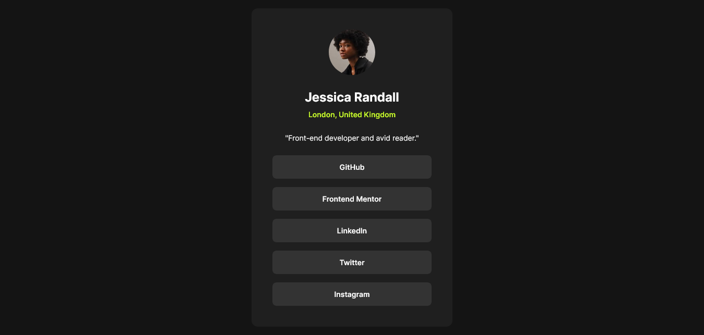

# Frontend Mentor - Social links profile solution

This is a solution to the [Social links profile challenge on Frontend Mentor](https://www.frontendmentor.io/challenges/social-links-profile-UG32l9m6dQ). Frontend Mentor challenges help you improve your coding skills by building realistic projects. 

## Table of contents

- [Overview](#overview)
  - [The challenge](#the-challenge)
  - [Screenshot](#screenshot)
  - [Links](#links)
- [My process](#my-process)
  - [What I learned](#what-i-learned)
- [Author](#author)

**Note: Delete this note and update the table of contents based on what sections you keep.**

## Overview

### The challenge

Users should be able to:

- See hover and focus states for all interactive elements on the page

### Screenshot



### Links

- Solution URL: [https://www.frontendmentor.io/solutions/social-links-profile-using-html-and-css-W40MWZ_sMb](https://www.frontendmentor.io/solutions/social-links-profile-using-html-and-css-W40MWZ_sMb)
- Live Site URL: [https://lucasngtg.github.io/social-links-profile/](https://lucasngtg.github.io/social-links-profile/)

## My process

### What I learned

I tried using a ```ul``` for the social media part. The links wouldn't fill up the entire ```li``` area. Ended up using a simple ```div``` and nesting the links directly, which was much easier.

## Author

- Frontend Mentor - [@LucasNgTg](https://www.frontendmentor.io/profile/LucasNgTg)
- GitHub - [@LucasNgTg](https://https://github.com/LucasNgTg)